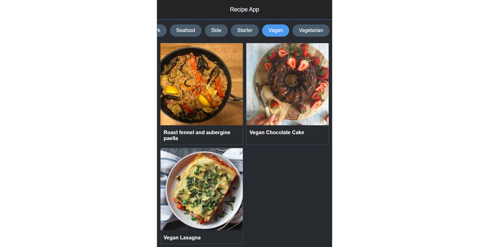

<h1 align="center">
  Recipe App
</h1>

<h3 align="center">
  API Utility
</h3>

  

The Recipe App project repository is a comprehensive web application built using HTML, CSS, and JavaScript that utilizes the themeladb API to showcase a wide variety of food recipes. This interactive and user-friendly app allows users to explore different dishes, access detailed recipes, and find inspiration for their culinary adventures.
  
The main objective of the Recipe App is to provide users with a platform to discover, learn, and experiment with various recipes. By leveraging the themeladb API, the app retrieves extensive information about different meals, including their ingredients, instructions, nutritional facts, and even accompanying images.
   
The Recipe App project repository empowers users to explore the world of culinary delights, providing a vast collection of recipes at their fingertips. Whether users are beginners looking for simple meal ideas or experienced cooks seeking new and exciting recipes, this app offers a valuable resource to inspire creativity and elevate their cooking skills.
  
By combining the power of HTML, CSS, JavaScript, and the themeladb API, this project demonstrates the potential of web technologies in creating engaging and user-friendly recipe applications. Developers can also leverage the project's modular structure and well-commented code to further enhance and customize the app according to their specific requirements.
  
Overall, the Recipe App project repository serves as an excellent starting point for developers and food enthusiasts alike, offering a comprehensive and dynamic platform to explore, learn, and share delicious recipes.

  
<!-- ................................................................................................................................. -->

### Features
 
Following are some of the new features and learning encountered while creating this amazing project:

- Extensive Recipe Collection:  The app offers an extensive collection of recipes, ranging from appetizers and main courses to desserts and beverages. Users can browse through a diverse range of meals, explore their ingredients, and access step-by-step instructions to recreate them in their own kitchens.

- Dynamic Search Functionality:  The app provides a powerful search functionality that allows users to search for recipes based on specific keywords, ingredients, or dietary preferences. This feature enables users to quickly find recipes that align with their preferences, dietary restrictions, or available ingredients.

- Interactive User Interface:  The app features a user-friendly and visually appealing interface that enhances the browsing experience. Recipes are displayed in an organized and easy-to-navigate format, making it simple for users to access key details such as cooking time, difficulty level, and required ingredients.

- Recipe Filtering and Sorting:  Users can further refine their recipe search by applying filters such as meal category, cuisine type, or even ingredients. Additionally, sorting options based on popularity, rating, or preparation time enable users to find recipes that best suit their needs and preferences.

- Favorite and Bookmark Functionality:  The app allows users to mark their favorite recipes and bookmark them for future reference. This feature enables users to create personalized collections and easily access recipes they particularly enjoy or plan to try later.

- Responsive Design:  The app is built with a responsive design, ensuring a seamless and consistent user experience across different devices and screen sizes. Whether accessed from a desktop computer, tablet, or smartphone, the app adapts its layout and functionality to provide optimal usability.

- Integration with themeladb API:  By integrating the themeladb API, the app fetches real-time data about meals, ensuring that the recipe collection remains up to date and diverse. This integration allows for a dynamic and continuously expanding database of recipes.

- Cross-browser Compatibility:  The app is thoroughly tested across popular web browsers to ensure compatibility and consistent performance. Users can access the app using browsers such as Chrome, Firefox, Safari, and Edge, guaranteeing a smooth experience regardless of their preferred browser.

  
<!-- ................................................................................................................................. -->

### Resources
 
Follwing resources have been used in maintaining this project:

- [Meal DB](https://www.themealdb.com/) is the API that has been used to build this project

  
<!-- ................................................................................................................................. -->

### Demo

  The Demo of this working project can be found on  
  <a href="https://rebrand.ly/RecipeApp_MABCORP">rebrand.ly/RecipeApp_MABCORP</a>

  
<!-- ................................................................................................................................. -->

### Video

You can exclusively watch the video on this project from the making to deploying on my     channel with the link given below 

  [Video Link](# )  

  If you like my video then do Like the Video and share it with others.

  
<!-- ................................................................................................................................. -->

### App's Interface  

  
<!-- ................................................................................................................................. -->

### Technology Stack
 
Follwing technologies have been used at the core of this application to make it stand in the market place:

- HTML
- CSS
- JavaScript
- themealdb API

  
<!-- ................................................................................................................................. -->

### Advancement

> User Interface could have been better

  
<!-- ................................................................................................................................. -->

### Deployment Details

The website is deployed using the free hosting provided by **Vercel**

  

  
Later on the link was customized using the well-known URL shortener and customizer **Rebrandly**:  

  

  
<!-- ................................................................................................................................. -->

### Developer

Muhammad Abdullah Butt  
abdullahbutt12292210@gmail.com  
> [Instagram](https://www.instagram.com/abdullah.butt.22/) 
> [FaceBook](https://www.facebook.com/profile.php?id=100076291614529) 
> [YouTube](https://www.youtube.com/channel/UCnuOFQyMywg-KuoN-lmav1Q) 
> [Portfolio](https://rebrand.ly/MuhammadAbdullahButt_MABCORP) 
> [Project Displayer]( https://rebrand.ly/ProjectDisplayer_MABCORP)
  
<!-- ................................................................................................................................. -->

